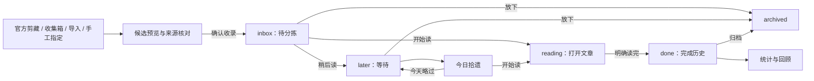

# 小驴拾遗：产品逻辑复盘与重整方案

> 2026-09-29，以仓库 `d392f43`（v1.0.4）为基线。本页是下一轮开发的产品与验收依据；涉及属性变更时，仍须先更新 [DATA-CONTRACT.md](DATA-CONTRACT.md)，再按 [AGENTS.md](../AGENTS.md) 开发。

## 一句话定位

**帮用户把已存进思源的网页文章变成可信的待阅读清单，并在合适的时候重新打开、读完或放下。**

用户应能回答四个问题：哪些文章已进入读库？今天可以读哪篇？读完后怎样记录？过一段时间还能否找回？AI、数据库、统计、快照和制卡只有在这条主线通畅后才有价值。

最短闭环：**发现有来源证据的文章 → 用户确认收录 → 分拣 → 立即开始读或留在稍后池 → 今日重浮再打开 → 明确标记读完 → 回顾**；不想继续读时可从活动队列归档。插件不应把“扫描到的普通笔记”直接算成“新剪藏”，也不应把“打开过”推断成“读完”。

## 当前事实与判断边界

- 已有的能力包括五态属性、候选扫描、迁移器、三种面板、每日重浮、AI 富化、数据库投影、导入器、收集箱、统计、快照、闪卡和打卡桥。它们是**代码已存在**，不等于**用户路径已验收**。
- `pnpm check` 为 0 错误、38 条 Svelte 告警；`pnpm test` 为 71/71 通过。测试集中在 domain 纯函数、i18n 和架构约束；[T-1108](../TODO.md) 的收录→迁移→流转→卸载后属性保留 E2E 尚未完成。官方扩展实剪、真机 UI、真实 AI、导入与收集箱等验收仍见 [BLOCKERS.md](BLOCKERS.md)。
- 下面的代码问题为静态审阅所得；尚未把作者真实工作区作为测试环境。重整时先用隔离工作区复现，再逐条修复和验收。

## 目前最影响使用的断点

| 级别 | 现状与证据 | 用户后果 | 重整要求 |
|---|---|---|---|
| P0 | `listAnchorDocs` 拼 `box IN (${boxes})`，笔记本 ID 没有 SQL 字符串引号（`src/services/clip-store.ts:172`） | 选了读库笔记本仍可能查不出候选；对账的 `allSettled` 只把失败留在控制台 | 修正查询并用真实笔记本 ID 跑隔离内核用例；失败在 UI 可见 |
| P0 | dry-run 只把结果放在弹窗内存，未创建 `migrate-progress.json`；执行却要求先读该文件；暂停还会被当成 `finished` 清掉进度（`src/ui/MigrateDialog.svelte:67,96`、`src/services/migrate-service.ts:137,183`） | “开始回填”无法从新扫描结果启动，暂停也不能可信续跑 | 扫描→确认→持久化任务→分批→暂停/恢复→报告形成完整流程；无 URL 在预览时即归“需补来源” |
| P0 | `batchSetStatus` 默认调用 `writeClip`，已有 `status` 被手填保护跳过，还把它计作成功（`src/services/clip-store.ts:61,120`） | 单篇、批量、看板拖卡看似操作，状态却不变 | 区分用户明确操作与自动覆盖；按真实写入数反馈 |
| P0 | `autoEnrich` 先入串行队列，又在队列任务里调用再次入队的 `enrichClip`（`src/services/enrich-service.ts:114,180`） | 开自动模式后队列互相等待，富化不能完成 | 保留一次排队，验证 off/manual/auto 和每日额度 |
| P0 | 锚点笔记本中的所有无属性文档都变成候选，混入 `inbox` 计数；插件生成的数据库/卡片/周报也可能入候选（`src/services/index-store.ts:76`、`src/ui/DockPanel.svelte:68`） | 普通笔记被误报为“新剪藏”，甚至可一键误收录 | 候选独立于读库五态；要求来源证据或用户明确选择；排除插件内部文档 |
| P1 | 普通 `captureClip` 只补状态、当前时间、优先级和来源类别，没有提取 URL、字数、时长（`src/services/clip-store.ts:97`、`src/domain/schema.ts:232`） | “已收录”却缺文章基本信息；README 的 3 分钟回填承诺不适用于此入口 | 所有入口走同一收录管线；字段缺失要可见，不能伪装完整 |
| P1 | 迁移器和导入器直接写 `custom-clip-*`，绕开统一属性服务；导入后的时间/状态未同步索引（`src/services/migrate-service.ts:160`、`src/services/import-service.ts:116`） | 属性与面板/重浮可能暂时冲突，保护规则失效 | 除用户 `tags` 外，所有 `custom-clip-*` 写入统一经 `clip-store`；支持批量与失败逐条结算 |
| P1 | 契约把“任意笔记本中带 URL 的文档”列作次锚点，查询却只搜 `status`；`captureClip` 又把仅有 URL 的文档视作已收录（`src/services/clip-store.ts:102,153`） | URL-only 文档成为没有队列的孤儿 | 同时发现 URL/status，明确半成品修复规则 |
| P1 | 每日重浮和超龄归档直接读缓存索引，没有先对账（`src/services/resurface-service.ts:40,66`）；对账也不清理已删除或已失去候选资格的旧条目 | 错误推荐、漏项或“幽灵文章”；批量归档可能作用于过期候选 | 写后对账、分页扫描、删除/资格判定和重建一致性用例；已收录文章移出锚点笔记本后仍由属性次锚点保留 |
| P1 | “本周读完”按文档 `updated` 猜测，周报却列出全部 `done`；已读文章改为 `archived` 后从已读数消失（`src/domain/stats.ts:69`、`src/services/stats-service.ts:33`） | 统计与阅读事实不符 | 完成时间、归档与已读历史分开定义；无可靠记录时不显示伪精确数 |
| P1 | 数据库只在设置页点“挂载”时同步属性→AV，未实现 AV 编辑→属性；标签侧栏只把标签塞进不搜标签的关键词；排序变量没有控件（`src/services/library-db.ts:94`、`src/ui/DockPanel.svelte:82,479,34`） | 界面有操作外观却无对应能力 | 把 AV 明确为可选投影；筛选/排序做真或暂时撤下文案 |
| P1 | “相关旧文”开关未被推荐逻辑使用，且仅在文档有引述块时显示；`enrichMode:off` 未在手动富化服务中把守，预置 AI 动作默认开启并在加载时创建（`src/ui/HighlightView.svelte:31,91`、`src/services/enrich-service.ts:119`、`src/services/settings.ts:59`） | 用户关闭后仍可能触发相关能力，阅读辅助位置不稳定 | 每个开关有可验证效果；默认值与开发协议对齐；阅读辅助围绕当前文章 |

## 统一对象与状态定义

| 对象 | 明确定义 | 必须满足的行为 |
|---|---|---|
| 扫描范围 | 用户选的笔记本、`#剪藏` 标签、已带剪藏属性的文档及用户手工指定的文档 | 范围只决定去哪里找；不能证明范围内每篇都是文章 |
| 待确认候选 | 有官方剪藏模板 URL、有效来源 URL、`#剪藏` 等证据，但尚无有效读库状态的文档 | 独立显示来源证据和缺失项；不计入 `inbox` 配额、重浮或阅读统计 |
| 已收录文章 | 用户确认后具有有效 `custom-clip-status` 的文档 | 始终可在队列中找到；有无 URL、全文、预计时长分别显示，不制造假数据 |
| 阅读载体 | 思源本地全文、仅来源链接、用户明确加入的本地文档 | “打开”优先打开可读内容；仅链接条目要清楚标识并能打开原文 |
| 文档属性 | 文章数据的唯一事实源 | 用户手填 URL/优先级/评分及迁移前已有状态受保护；用户显式改状态可覆盖旧状态 |
| 派生索引/AV | 可重建的投影 | 索引重建后与属性相同；AV 未证明反向同步前只承诺单向投影 |

五态只描述**当前阅读队列**，不描述文章的所有历史：

| 状态 | 用户含义 | 进入方式与主操作 |
|---|---|---|
| `inbox` | 已确认收录，尚未决定何时读 | 新收录进入；分拣为“稍后读 / 开始读 / 归档” |
| `later` | 有意保留，等待合适时机 | 用户明确选择稍后；可开始读或归档 |
| `reading` | 用户正在读 | “开始读”同时设状态并打开文章；单纯点击标题只打开，不推断状态 |
| `done` | 用户明确确认读完 | “标记读完”记录真实完成时间；允许用户在别处读完后补记 |
| `archived` | 不占活动队列 | 用户主动归档，保留是否读完和完成时间；可恢复到稍后读 |

**今日拾遗**从可重看的未读池（首先是 `inbox/later`）挑选。主动作应是“开始读”；“今天略过/改天”只影响当日展示，不谎称已读；“归档”是明确放下。已读回看如果要做，单列模式与文案，不混在未读池。完成时间与原收藏时间需要先写数据契约，再实现迁移与统计。旧文档若无法辨认真实收藏时间，应显示“时间未知/按文档创建时间估计”，不能统一用迁移当天当作旧文原始时间。

## 用户一步步怎样使用

1. **第一次打开：说明用途并选扫描范围。** 引导先说明“插件管理已在思源的文章”，让用户选笔记本，并说明现有固定的 `#剪藏` 标签也会被扫描。立即给出“已收录、可确认候选、需补来源、普通笔记”四类数量和示例；此步只读，不批量写属性。没有候选时给出官方剪藏、收集箱和手动加入的入口。
2. **整理旧文章：预览后确认。** 迁移器只对有来源证据的旧文提取 URL、来源站、字数及可信时间；逐条标出“将写入/已有属性跳过/需手工补 URL/解析失败”。需补来源时允许逐条填或纠正 URL，也可明确转为“本地文档”；误报可标为“不是文章”，后续扫描不反复打扰。确认后保存任务，再分批执行，可暂停恢复；完成时展示真实成功、跳过、失败与待处理清单。跨笔记本 `#剪藏` 文档也应能走这条路径。
3. **以后新增：统一收录。** 官方剪藏文档、思源收集箱、外部导出和右键加入经同一属性写入规则。收集箱可带全文，Pocket 等导出通常只有链接，界面必须区分。写入前按规范化 URL 做精确查重并让用户处理冲突；AI 语义相似只提示，不自动拒绝。补字段后进入 `inbox`。手动加入的本地文档可无 URL，但须明确标为“本地文档”。
4. **每天分拣与阅读。** `inbox` 只显示已确认条目；用户点“稍后读”“开始读”或“归档”。开始读打开相应文档/原文并将其移到 `reading`；读完后明确点“标记读完”，可选评分与摘录。看板、侧栏、工作台使用同一状态动作和相同结果反馈。
5. **日后拾遗。** 今日页从未读池挑少量文章，展示“为什么出现”（等待天数/用户优先级等），提供开始读、今天略过、归档。重复打开今日页不改变数据；日期变化后按规则重新挑选。超龄批量归档先给出候选清单，再由用户执行。
6. **回顾与扩展。** 统计只用可信的入库/完成时间；周报只列本周完成。AI 摘要/标签/查重、AV、快照、制卡、打卡桥分别从阅读过程进入，各自失败不阻断收录与阅读。

## 按依赖推进的开发与验收

| 阶段 | 工作范围 | 过关条件 |
|---|---|---|
| S0 事实对齐 | 本方案、决策与任务重排；把“代码完成/隔离内核通过/真机验收”分开记账 | 已有入口/字段的现状、目标和未决项清楚列出；发布历史与当前待办有一致解释 |
| S1 救回主链 | 修笔记本 SQL、迁移任务初始化、状态显式写入与成功计数、自动富化队列；统一迁移/导入属性写入 | 隔离工作区按官方扩展 payload 模拟一篇剪藏，再用一篇旧文走通发现→预览→收录/回填→状态流转→重启和重建索引；真实扩展实剪另见 B-0001，不出现假成功 |
| S2 可信收录 | 候选资格与内部文档排除、URL-only 半成品修复、来源/全文类型、元数据与时间可信度、分页对账 | 混有普通笔记的笔记本不会被一键误收录；跨笔记本标签文档可处理；无 URL/无全文清楚标示 |
| S3 阅读动作 | 统一侧栏/工作台/看板的分拣、开始读、完成、归档、恢复；优先级/评分入口；真实标签筛选与排序 | 同一篇文章在不同画布做同一动作，属性、索引和可见队列一致；读完历史不因归档丢失 |
| S4 重浮与回顾 | 今日挑选、略过/归档、完成时间、统计与周报口径、超龄归档预览 | 今日页稳定且不读即不改状态；“本周读完”只含真实本周完成；过期候选与实际归档数一致 |
| S5 可选能力逐项验收 | AI 三态与通道、查重/相关、AV 投影、收集箱/外部导入、快照、闪卡、打卡桥 | 每项有独立的真实入口、开关/失败反馈和验收样例；未验证的双向/自动能力不在 UI 和 README 承诺 |
| S6 发布门禁 | 完成 T-1108 隔离内核 E2E、作者桌面端真实文章走查、移动/浏览器主链冒烟、文档/中英说明对齐 | 真实使用流程与卸载后属性保留均通过，所有 P0 关闭；再按 RELEASE.md 讨论版本与发布 |

每阶段记录三种状态：**实现完成、隔离验证通过、作者真机验收通过**。任何阶段只通过编译和纯函数测试，都不能写“用户流程完成”。需要修改属性/端点时遵循契约先行；发 tag、Release 和集市提交仍按仓库协议另行请示。

## 最小端到端验收样本

隔离工作区准备：一篇按官方剪藏扩展 payload 模拟的全文、一篇同笔记本普通笔记、一篇跨笔记本 `#剪藏` 旧文、一篇仅有 `custom-clip-url` 的半成品、一条 Pocket 链接导入、一篇插件生成的周报/数据库宿主文档。逐步检查：扫描分类准确；确认收录后字段来源可信；迁移暂停/恢复可用；五态单篇/批量/看板操作真实写入；重启与索引重建不变；今日拾遗和统计反映真实操作；AI 关闭时主流程完整；卸载插件后 `custom-clip-*` 仍在。真实扩展实剪另按 B-0001 验收；真机 UI 验收在隔离数据或作者自行选择的测试文章上进行，不以当前源码门禁替代。

## 仍需产品裁决的细节

本方案暂按以下口径规划，涉及字段时在 S1/S2 先改 DATA-CONTRACT 并新增决策：

- 主阅读对象是思源里的**全文剪藏**；外部导出的链接条目是次级载体，界面明确标识。
- `custom-clip-time` 的确切含义及其时间来源须在 S2 定义：当前普通收录写“操作时刻”，迁移也写“操作时刻”，外部导入却改写为“原服务收藏时刻”，不能继续混用于吃灰天数与新增统计。
- `archived` 表示退出活动队列，不抹去“读过”事实；需有独立完成时间或等价持久记录。
- 首次扫描采取“有证据才列候选，用户确认才入库”；读库笔记本是扫描范围，不是整本笔记自动收录。
- AI 默认 `manual`，自动富化须用户明确开启；自定义 AI 通道已存在，但只在它支持的平台和已验收的模型配置上承诺可用。

这些是重整设计的工作假设；若作者偏好的主场景不同，应先调整此页与决策记录，再改代码。
